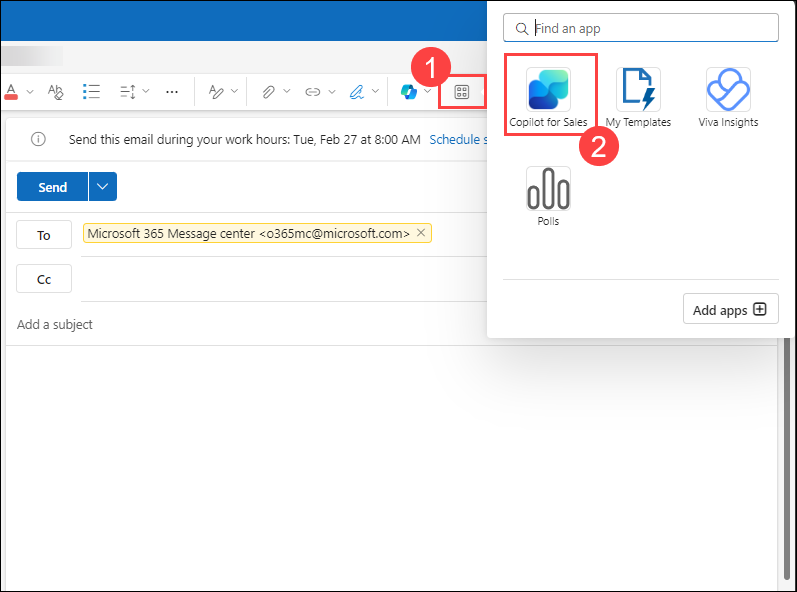
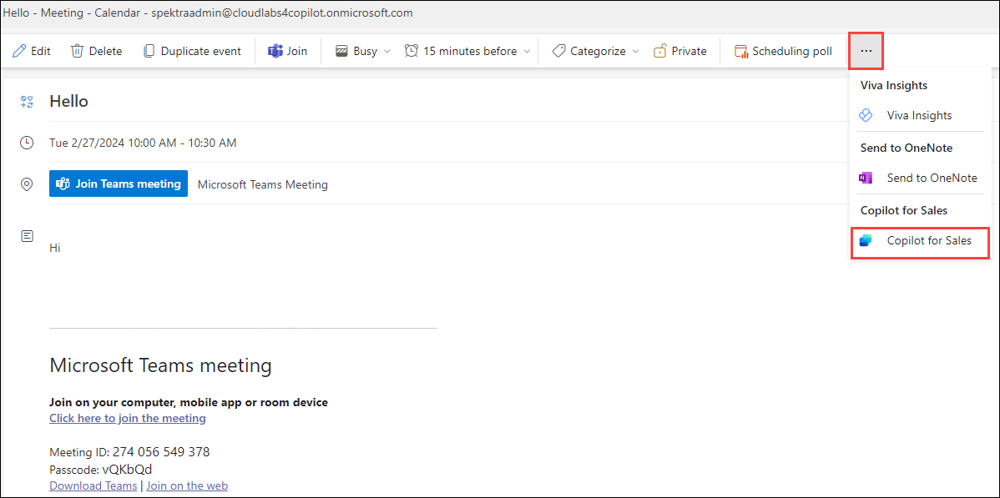
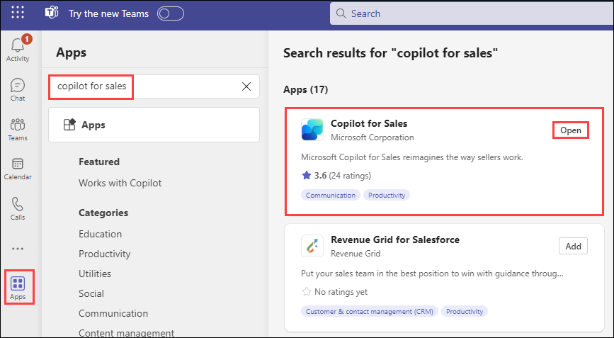
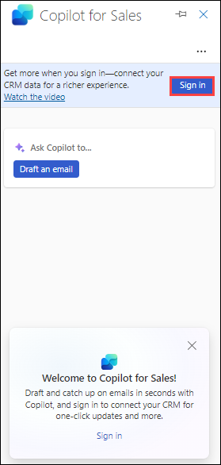
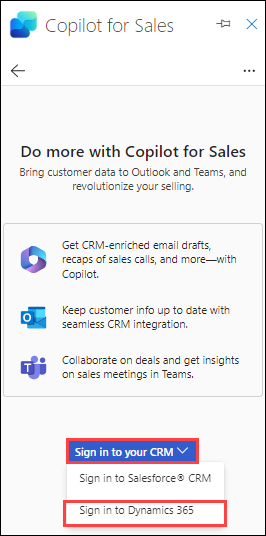
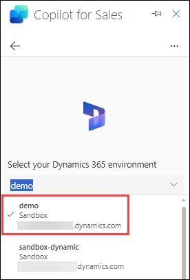

# Lab 01: Getting Started with Microsoft Copilot for Sales

## Task 1: Access the Copilot for Sales app

- While drafting an email or creating a meeting

1. In Outlook, click on **New Mail**.

      

1. Mention the email of the receiver, click on **Apps (1)** and select **Copilot for Sales (2)**.

   

1. Click on **Copilot for Sales** again.

   
   
- While reading an email

1. Open any customer mail, click on **Apps** and select **Copilot for Sales**.
   
   
   
- While opening a meeting

1. Open Calendar in Outlook and select the scheduled meeting.
   
1. Select **More commands (...)** and then select **Copilot for Sales** (in Simplified ribbon)

   

- Access Copilot for Sales in Teams
  

1. Select **Apps** and click on **Copilot for Sales** to view.
   
   
   
## Task 2: Sign in to CRM from Outlook

1. In Outlook, open a customer mail, click on **Apps** and select **Copilot for Sales**.
   
1. In the **Copilot for Sales** pane, select **Sign in** in the banner at the top or card at the bottom.

   

1. Select **Sign in** to your CRM and select in to Dynamics 365 from the dropdown.

      
   
1. Choose the **Environment** where you wish to sign in.

   

1. Click on **Get Started**.

   
   
**Note:** - You can also sign in through Salesforce CRM:  
- Select your **Salesforce environment**, and then select **Sign in**.   
- In the confirmation message, select **Allow**.
- Enter your Salesforce credentials, and then select **Log In**.   
- Select **Allow**, and then select **Allow access**.
