# Lab 02: View and update CRM data in the flow of work

# CRM Actions

## Lab Scenario

Microsoft Copilot for Sales reduces the need for frequent context switching so that you can find the information that you need. Keeping the correct CRM data accessible and in the flow of work in Outlook and Teams makes updates and references to CRM data near effortless.

## Lab Objectives

In this lab, you will perform:

- Create a contact in your CRM from Copilot for Sales 
- Connect a contact to your CRM
- Change the connected CRM contact 
- View and update CRM data 
- Search and share CRM data
- Connect and save emails and meetings to CRM 
- View recent and upcoming activities
- Add private notes
  
### Task 1: Create a contact in your CRM from Copilot for Sales 

- Create a new Record

1. Click on **Add (+)** on the top right once signed in.

     

1. Click on **Create Record**.

      
  
1. Add the details for the contact and click on **Save**.

    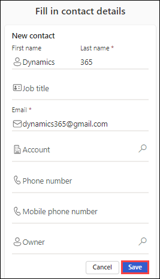
   
- Create a contact from an exisiting Email
  
1. In the **Copilot for Sales** pane, select a mail from the inbox.

1. Click on **Apps** and select **Copilot for Sales**, and then select **Add to Dynamics 365**.

   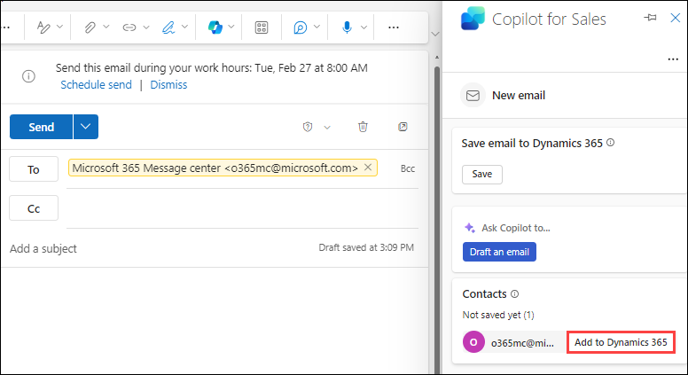

1. In the **New contact** form, add the required information, and then select **Save**.
   
   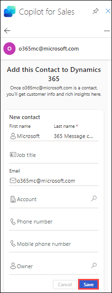
   
### Task 2: Connect a contact to your CRM 

**Note:** We can link a contact to another contact if there are already two or more contacts saved or select **Create a new contact** to create a contact.

1. Open the email and click on the **More Options(...)** beside the saved contact and open through **Dynamics 365**.

1. Click on **Connect** on the top, select the record and provide a **role** and a **description** based on the connection you would like to create in the **Connect To** tab.

   

   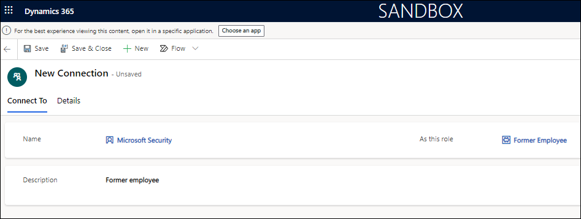
   
1. Add the **Owner (1)** record under the **Details** tab and click on **Save and Close (2)**.

   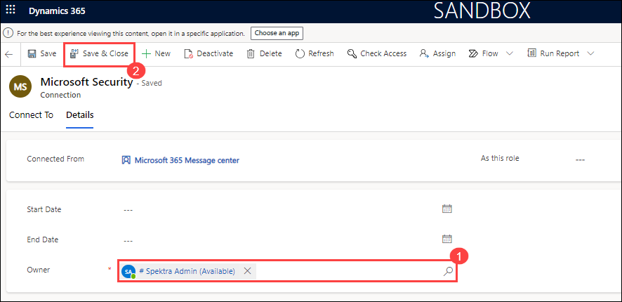

### Task 3: Change the connected CRM contact 

1. Open the email and click on the **More Options(...)** beside the saved contact and open through **Dynamics 365**.

1. Click on **Related** and select **Connections**.

   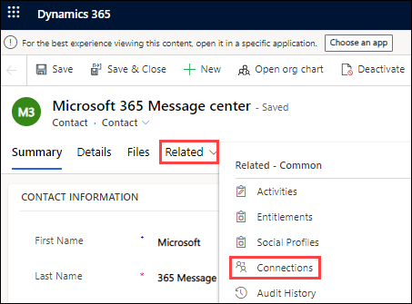
   
1. Choose any existing connection and click on **Edit**.

   

1. Change the **contact name** and **description**  based on the connection you would like to create.

   

1. Click on **Save and Close** and verify its changed.

   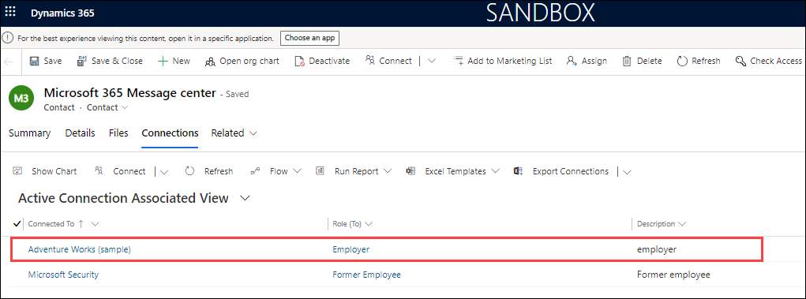

### Task 4: View and update CRM data 

1.	Open the **Copilot for Sales** pane and select a record you want to edit.

1.	In the record's details cards, select **More actions (...)** and then select **Edit record**.

      

1.	Update the details as needed and select **Update**.

### Task 5: Search and share CRM data

- In Outlook

1.	Open the **Copilot for Sales** pane.

1.	In the (record type) card, scroll down and select the saved contact, clcik on the **ellipsis** and select **Copy link**.

      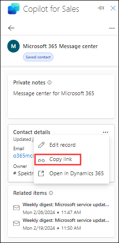

1.	Paste the link in a Teams chat or email.

- In Teams

1. Open any customer chat and click on **More Options(...)** and select **Copilot for Sales**.

   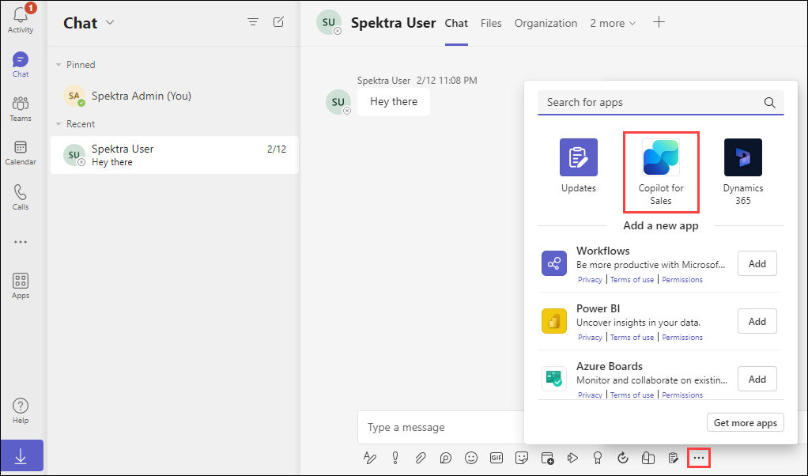

1. Attach the required contact and the CRM record of that contact can be shared with anyone over teams.

   

### Task 6: Connect and save emails and meetings to CRM 

1.	Open the email or meeting you want to save to the CRM, and then open **Copilot for Sales**.

1.	Select **Save** under **Save email to Dynamics 365**.

      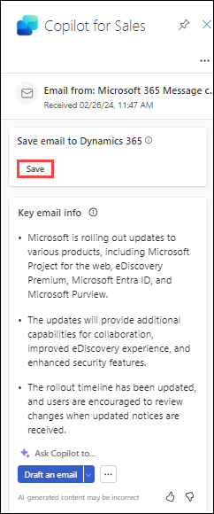

1. Enable **server-side synchronization** when prompted.

1.	Under **Connect to a record (1)**, select the record you want to connect the activity to and select **Save (2)**.

      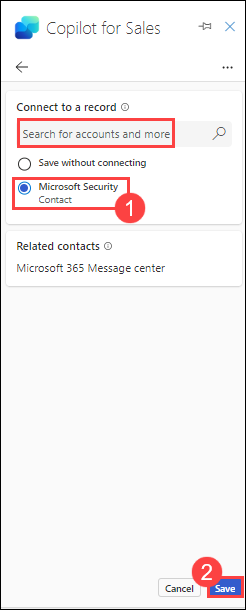

      **Note:** If you want to save the email or meeting to CRM without connecting to a record, select **Save without connecting**. The email or meeting will still be associated with contacts on the To, Cc, and Bcc fields.

### Task 7: View recent and upcoming activities

1. Open any email or meeting and then open **Copilot for Sales** pane and select the saved contact.

      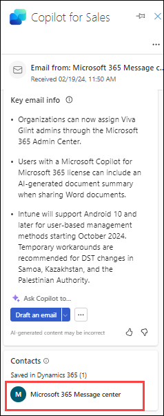

1. Click on any **Related Items** you want to view and it opens the item in a new tab.

      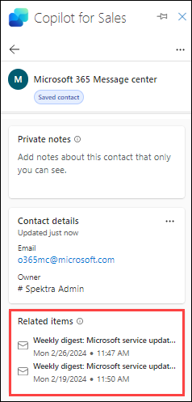

### Task 8: Add private notes

1.	Open the **Copilot for Sales** pane.

2.	In the **Contacts** card, select the contact to which you want to add notes.

3.	Enter your **notes** about the contact in the **Private notes** card.

      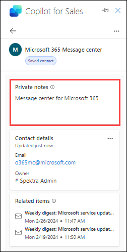

4.	Select anywhere outside the Private notes card to save the note.

## Review

In this lab, you have explored various features after creating a contact.

### You have successfully completed the lab
