# Lab 02: View and update CRM data in the flow of work

# CRM Actions

## Lab Overview

Microsoft Copilot for Sales reduces the need for frequent context switching so that you can find the information that you need. Keeping the correct CRM data accessible and in the flow of work in Outlook and Teams makes updates and references to CRM data near effortless.

In this lab, you will explore the features of Microsoft Copilot for Sales, which helps you create new contacts or leads directly from your Outlook inbox to keep track of your stakeholders. When you send or receive an email from a customer not tracked in your CRM, Copilot suggests adding them. You will learn to create new contacts or leads using the customer's email signature. Copilot ensures related contacts, opportunities, and account records are easily accessible.

## Lab Objectives

In this lab, you will perform:

- Task 1: Create a contact in your CRM from Copilot for Sales 
- Task 2: Connect a contact to your CRM
- Task 3: Change the connected CRM contact 
- Task 4: View and update CRM data 
- Task 5: Search and share CRM data
- Task 6: Connect and save emails and meetings to CRM 
- Task 7: View recent and upcoming activities
- Task 8: Add private notes
  
## Task 1: Create a contact in your CRM from Copilot for Sales 

### Task 1.1: Create a new Record

1. Navigate back to **Copilot for sales** environment, if you have switched the environment in the previous lab.

1. Click on the **ellipses(...) (1)** , then select **Switch environment (2).**

     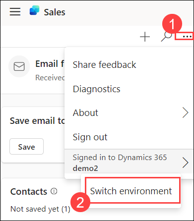

1. Select **Copilot for Sales** and click **OK.**

     

1. Click on **(+)** on the top right once signed in to create a new record.

     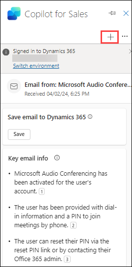

1. Click on **+ Create Record**.

      
  
1. Add the details for the contact and click on **Save**.

    
   

     >**Note:** If prompted save this email as part of this contact record click on **Save.**
     
     >**Note:** Please create one more contact record by following the same steps, with your name and email address that your going to use in ***Lab 4 - Task 4.***

### Task 1.2: Create a contact from an exisiting Email
  
1. Open a mail from the inbox then click on the **elipses(...).**

1. Click on **Apps** and select **Copilot for Sales**, and then select **Add to Dynamics 365** beside your contact.

    >**Note:** Contacts name can be anything based on your customer or recieved email.

   

1. In the **New contact** form, add the required information, and then select **Save**.
   
   

    >**Note:** ***First name, Last name and Email*** is based on your customer or recieved email. Not necessary to match with the Screenshot.   
   
### Task 2: Connect a contact to your CRM 

**Note:** We can link a contact to another contact if there are already two or more contacts saved. If there is only one contact select **Create a new contact** to create a contact.

1. Open the mail, and open the Copilot for Sales pane from it. Click on the **More Options(...) (1)** beside the saved contact and click  **Open in Dynamics 365 (2)**.

    

1. Click on **Connect** on the top.

     

1. Select the record and provide a **role** and a **description** based on the connection you would like to create in the **Connect To** tab. 

    
   
1. Navigate to **Details** tab, choose the **Owner** and click on **Save and Close**.

    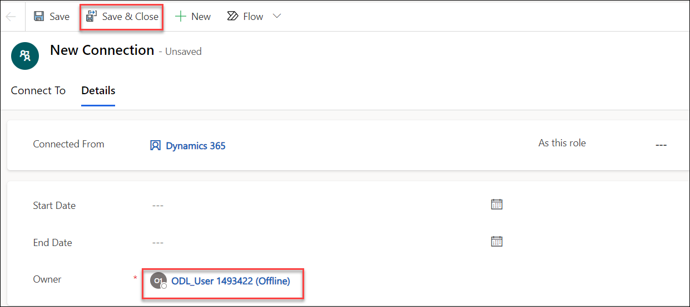

### Task 3: Change the connected CRM contact 

1. Open the email, click on **Apps** then select **Copilot for Sales**. Scroll down then hover the cursor on the saved contact then click on the **More Options(...) (1)** and select **Open in Dynamics 365 (2)**.

   

1. Click on **Related (1)** drop-down and select **Connections (2)**.

   
   
1. Choose any existing connection **(1)** and click on **Edit (2)**.

   

1. Change the **contact name (1), role (2) and description (3)**  based on the connection you would like to create then click on **Save and Close (4).**

   

1. Click on **Save and Close** and verify its changed.

   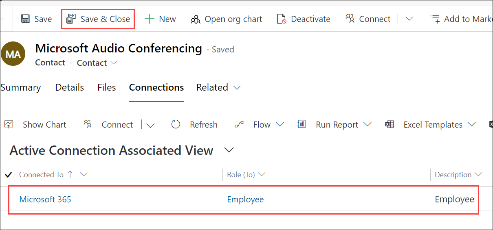

### Task 4: View and update CRM data 

1.	Open the **Copilot for Sales** pane and select a record you want to edit.

1.	In the record's details cards, select **More actions (...)** and then select **Edit record**.

      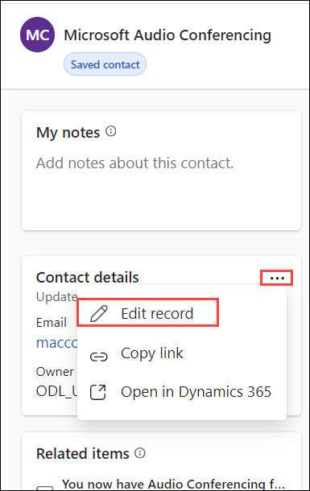

1.	Update the details as needed and select **Update**.

### Task 5: Search and share CRM data

- In Outlook

1.	Open the **Copilot for Sales** pane.

1.	In the (record type) card, scroll down and select the saved contact, clcik on the **ellipses (...)** and select **Copy link**.

      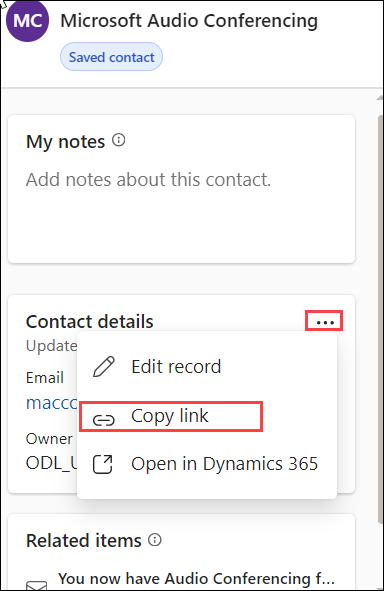

1.	Paste the ***link*** in a Teams chat or email.

- In Teams

1. Open any customer chat and click on **More Options(...)** and select **Copilot for Sales**.

    >**Note:** If there is no chat in teams. Please send a greetings mail from your personal outlook mail to the ODL_User and Click on the edit button in teams and paste your email/username.
    
    - Navigate to your personal Outlook, click on **New mail (1)** then provide the ODL_User email **(2)** given in the LabVM's Environment tab then type a greeting message **(3)** and then click on **Send (4).**

       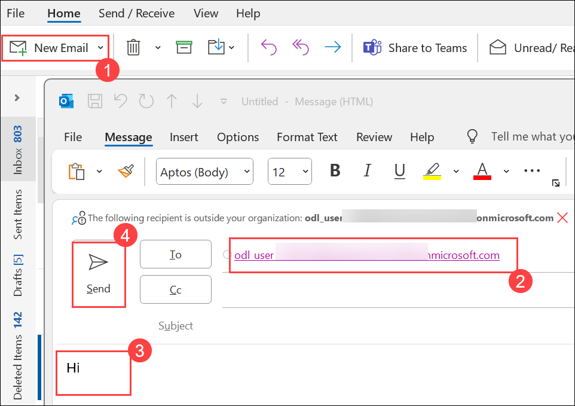

    - Click on the edit **(2)** button in teams and paste your email/username **(2)**.
  
       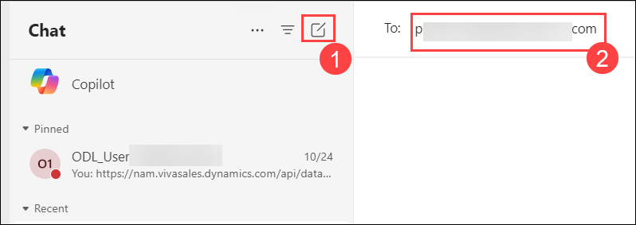

1. Paste the link in chat and Attach any required contact and the CRM record of that contact can be shared with anyone over teams.

   

### Task 6: Connect and save emails and meetings to CRM 

1.	Open the email or meeting you want to save to the CRM, and then open **Copilot for Sales**.

1.	Select **Save** under **Save email to Dynamics 365**.

      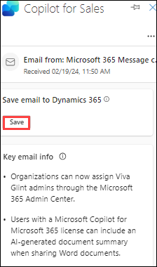

1. If prompted, cLick on **Turn on** for **server-side synchronization** when prompted.

1.	Under **Connect to a record**, select the record **(1)** you want to connect the activity to, if  the records are not coming up please search the name and select **Save (2)**.

      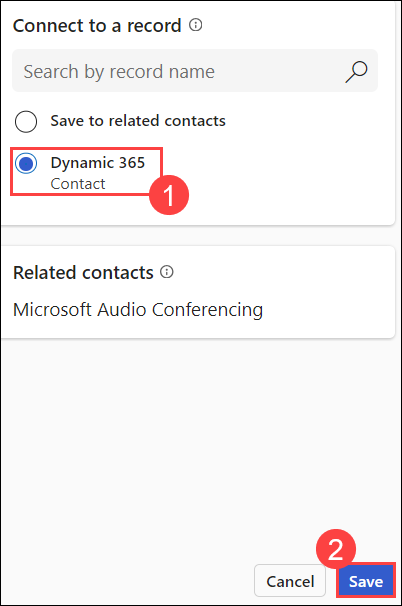

      **Note:** If you want to save the email or meeting to CRM without connecting to a record, select **Save without connecting**. The email or meeting will still be associated with contacts on the To, Cc, and Bcc fields.

### Task 7: View recent and upcoming activities

1. Open any email or meeting and then open **Copilot for Sales** pane and select the saved contact.

      

1. Click on any **Related Items** you want to view and it opens the item in a new tab.

      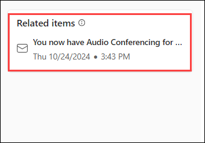

### Task 8: Add private notes

1.	Open the **Copilot for Sales** pane.

2.	In the **Contacts** card, select the contact to which you want to add notes.

3.	Enter your **notes** about the contact in the **My notes** card.

      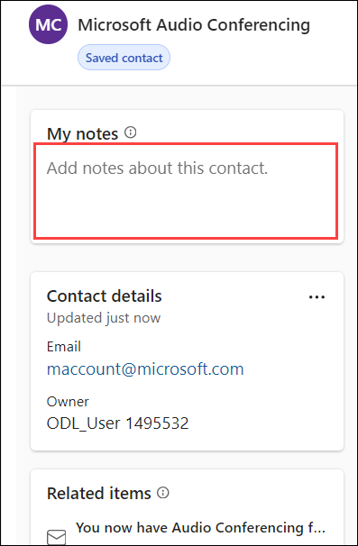

4.	Select anywhere outside the Private notes card to save the note.

## Review

In this lab, you have explored various features after creating a contact.

### You have successfully completed the lab
