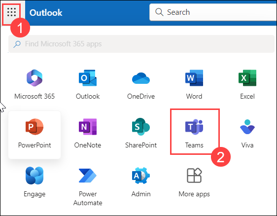
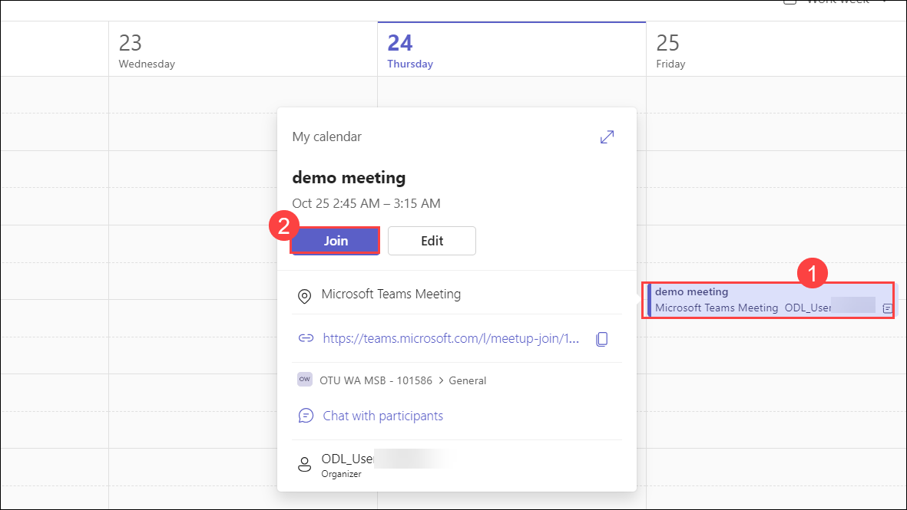
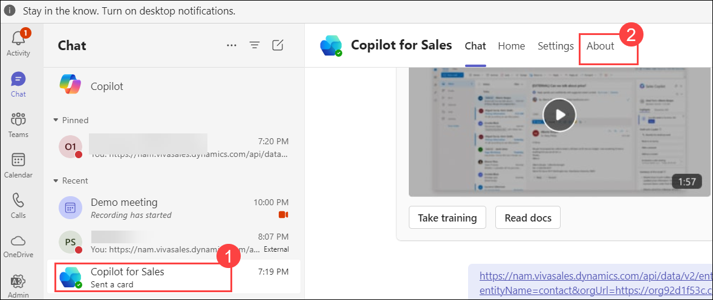
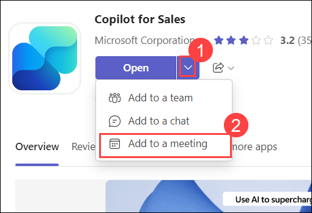
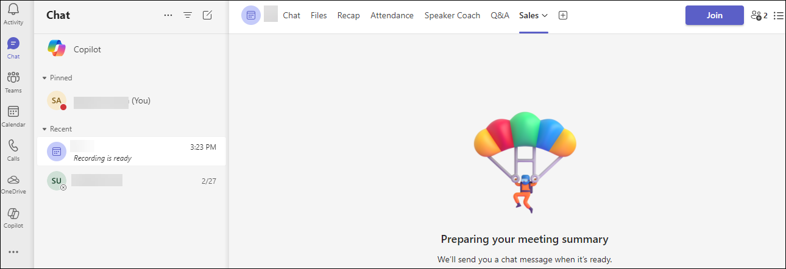
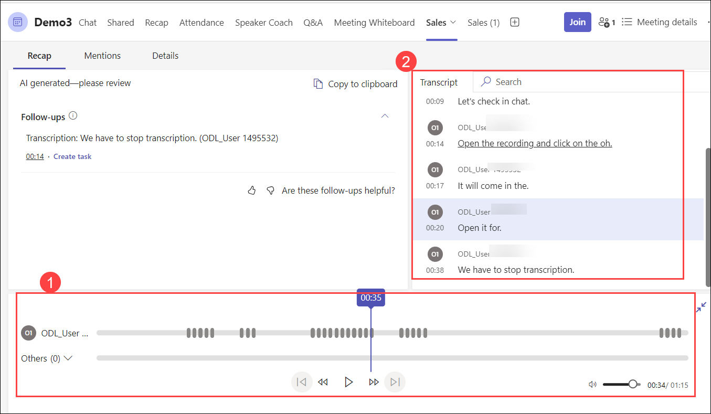
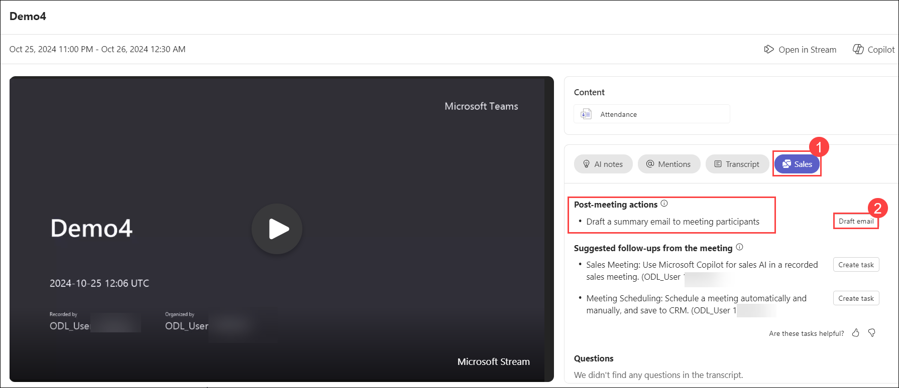
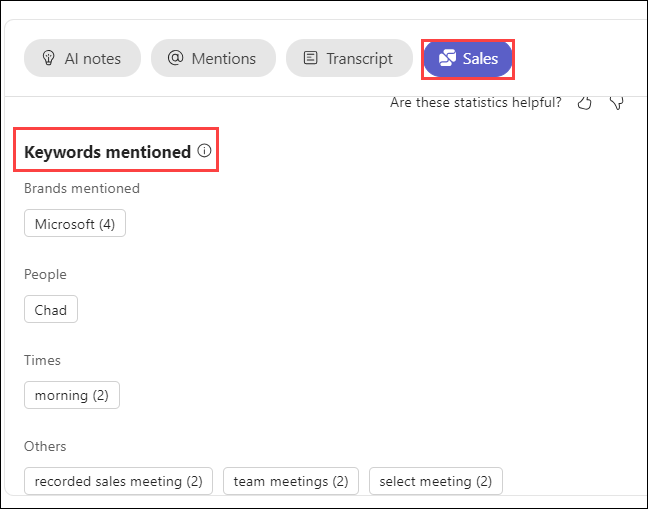

# Lab 04: Drive AI-powered sales (READ-ONLY)

# Capabilities in Teams 

# Elevate Sales Meeting 

## Lab Overview

In this lab, you'll explore the Copilot for Sales app within Microsoft Teams, designed to enhance your meeting efficiency with sales contacts. You will learn how to view the meeting preparation card and record the meeting. Copilot for Sales uses the recorded call and transcript to generate and summarize rich meeting insights. The meeting summary provides an overview of how the conversation went. It includes action items and relevant keywords, a breakdown of customer sentiments during the call, and more

## Lab Objectives

In this, you wil perform:

- Task 1: Create a Teams Meeting
- Task 2: Use Microsoft Copilot for Sales AI in a recorded sales meeting 
- Task 3: Analyze sales meetings with AI-generated meeting summaries

### Task 1: Create a Teams Meeting

- You must invite at least one external participant to the meeting.
- You must transcribe the meeting for Copilot for Sales to generate insights.
- If you create a recurring meeting, the Copilot for Sales app is added to all occurrences of the meeting.

1. Navigate to **Teams (2)** from Outlook by clicking on the **More Options (1)** on the top left of the Outlook Window.

   

1. Select **Calendar** from the left pane and click on **+New Meeting** from the top right corner.

   

1. Provide the following details to create a new meeting and click on **Send**.

      - **Provide a name for the meeting (1)**
      - **Add the users you would like to add to the meeting  (2)** (*You can provide the email of the user present in team chat*)
      - **Mention the Date and Time of the meeting (3)**
      - **Add the channel (Optional) (4)**
      - **Outline what will be discussed during the meeting (5)**

           

### Task 2: Use Microsoft Copilot for Sales AI in a recorded sales meeting 

**Note:** There are two ways we can schedule a meeting.

**Automatically** - When you schedule a meeting with a contact who is saved to your CRM, the system automatically enables Microsoft Copilot for Sales when it records and transcribes the meeting.

**Manually** - 

1. Navigate to the **Calendar** in *Teams*  them select the meeting name **(1)** and click on **join(2).** 

   

1. Open the **Copilot for Sales (1)** chat and click on **About (2).**

   

1. Click on **Open (1)** drop down and select **Add to a meeting (2).**  

   

1. Select the meeting name **(1)** then click on **Set up (2)** drop-down and select **Set up a tab (3).**

   

1. Click on **Save.** 

1. Open the meeting and Start the **recording and transcription**. Then Begin by speaking for a few minutes.

   

### Task 3: Analyze sales meetings with AI-generated meeting summaries

1. Stop the **recording** and **leave** the meeting. Then you will be able to see the recording.

1. Open the recording and click on the **Sales** Tab.

      **Note:** You might receive the below pop-up stating that the summary will take a while to show up and will notify via chat when it has fetched the insights.

   

1. In the mean time you can proceed with next task.   

1. After some time, naviagte back to the recording chat again, click on **Sales** tab. There you can review the recording that includes both **Recording (1)** and **Transcription (2)** of the meeting.

   

### Task 4: Explore AI-generated meeting summaries with new Options.

1. Go to the meeting chat in your chat list, select the **Copilot for Sales (1)** tab and select **Open recap (2)**.

   

1. Navigate to **Sales (1)** tab, there you can find an option to **Draft email (2)** click on it.that will directly draft a summary email to meeting participants.

   

1. Here you can see the ready email summary reagarding the meeting. It can be send to the Participants mail by clicking on the **Open in Outlook web.**   

   

1. It also provides the **Keywords mentioned** in the meeting.   

   

1. Navigate to **Transcript** tab, here you can find meeting transcript and also you can doenload it.

   

1. Navigate to **AI notes,** here it will provide us the details about the discussions that happened in the meeting session.   

   

## Review

In this lab, you have understood how to use Copilot for Sales during teams meetings.

### You have successfully completed the lab.
