# Lab 05: Customize Microsoft Copilot for Sales (in Teams and Outlook) 

## Lab Scenario

Many sales organizations customize their CRM to meet their business needs. Microsoft Copilot for Sales is preconfigured to work with contact, opportunity, and account records. The admin experiences allow for sales organizations to define what matters to them, helping to ensure that their sales teams have the necessary CRM data accessible to them.

## Lab Objectives

- CRM customizations and controls in Teams and Outlook

### Task 1: CRM customizations and controls (in teams) 

### Task 1.1: Copilot AI

1. Click on **Apps** and open **Copilot for Sales**.

   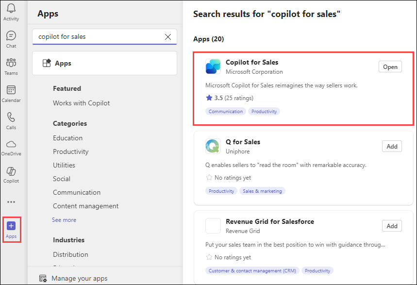

1. Click on **Settings** and select **Copilot AI** under Environment tab and review the features provided. Enable or disable based on your preferences.

   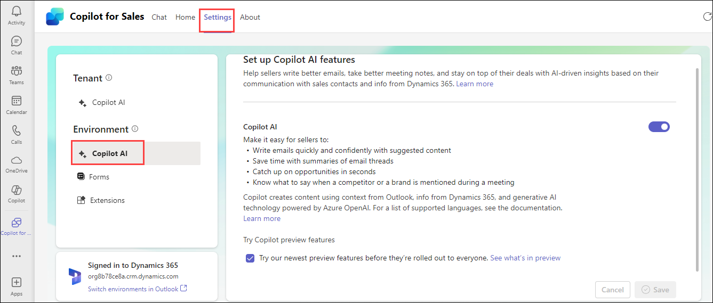

### Task 1.2: Forms

### Add a new record type

1. Click on **Settings** and select **Forms** under Environment tab and click on **Add record type**.

   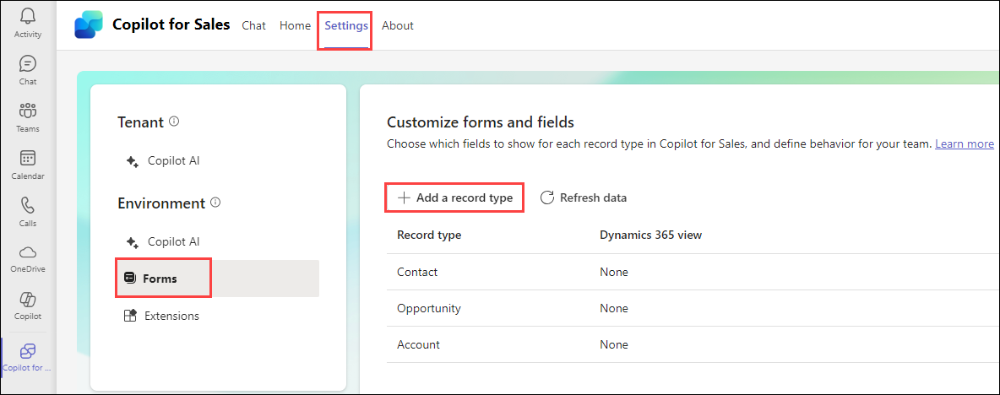

1. In the **Add a record type**, select a record type to **add**, and then select **Next**.

   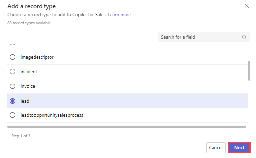

1. In the **Select the relationship** for (record type) window, select the **relationship** to existing record types or fields in Copilot for Sales, and then select **Next**.

   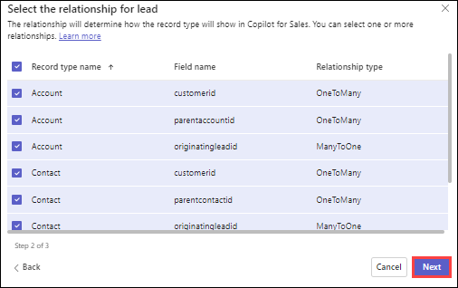

1. In the **Select the view** for (record type) window, select the view to define how a list of records for a specific record type is displayed, and then select **Add**.

   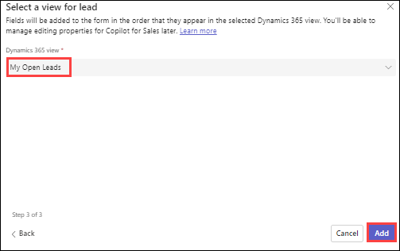

1. On the record type settings page, select **Publish** to save your changes.

   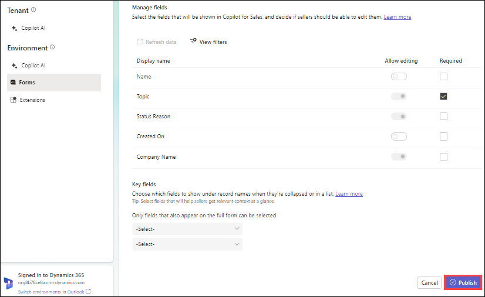

### View filters used in a view

1. Select a record type for which you want to see the query used in the selected view.

1. Select **View filters** under the **Manage fields** section.

   

1. To copy the query XML, select **Copy XML**.

### Modify record types not based on a CRM view
### Add fields

1. Select a **record type** to which you need to add fields.

   

1. In the **Manage fields** section, select **Add fields**.

   

1. In the **Add fields** window, **select** fields to display in the form, and then select **Add**.

   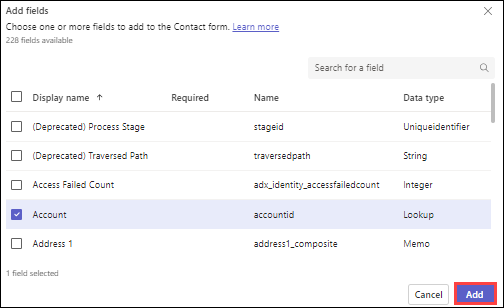

      **Note:** The new fields are added after existing fields, but you can reorder them.

1. Select **Publish** to save your changes.

### Reorder fields

1. Select the record type in which you need to reorder fields.

1. In the **Manage fields** section, hover over the field you want to reorder, and then select the **Move up** or **Move down** arrows.

   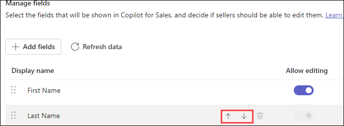

   **Note:** You can also drag the field to change its order.

1. Select **Publish** to save your changes.

### Remove fields

1. Select the record type from which you need to remove fields.

1. In the **Manage fields** section, hover over the field you want to remove from the form, and then select **Remove field**.

   
   
1. Select **Publish** to save your changes.

### Mark fields as required in Copilot for Sales

1. Select a record type for which you need to mark the fields as required.

2. In the Manage fields section, select **Required** for the fields that you want to mark as required.

   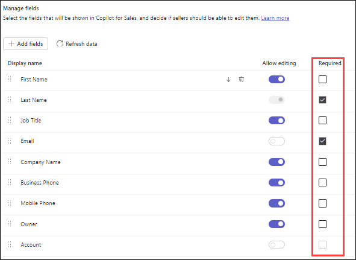

3. Select **Publish** to save your changes.

### Configure editing of records and fields
### To allow editing of records

1. Select a record type for which you need to allow editing.

1. Turn on **Editing records** to allow sellers to **edit** all relevant fields in that record type.

   

1. To restrict editing for specific fields, in the **Manage fields** section, and **turn off Allow editing** for corresponding fields.

1. Select **Publish** to save your changes.

### To configure new contact creation:

1. Select the **Contact record** type.

1. Under **Allow editing**, select **Allow new contacts to be created directly from Copilot for Sales**.

1. Select **Publish** to save your changes.

### To select key fields

1. Select the record type in which you need to select fields for mini view.

1. In the **Key fields** section, select fields from the list.

   

1. Select **Publish** to save your changes.

     **Note:** The changes made will reflect in **Outlook**.

### Task 2: Discover more options in Microsoft Copilot for Sales (in outlook) 

### Task 2.1: Switch environments or CRM

**Note:** To **switch environments**, there should be two or more environments created in power apps platform.

1. In the **Copilot for Sales** pane, clcik on the **Options(...)** on the top right and click on **Signed into Dynamics 365**.

1. Select **Switch environment**.

    

    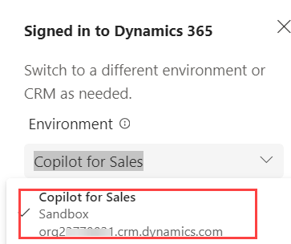

### Task 2.2: View diagnostics data

1.	Open **Copilot for Sales**.

1.	Select the **Options(...)** in the upper-right corner, and then select **Diagnostics**.

    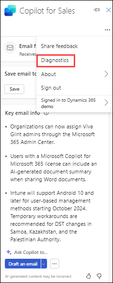

1.	Select **Copy details** to copy the diagnostics data, and then paste the data into an email, Teams chat, or any other medium you like to use to share it with technical support team.

    

### Task 2.3: Share Feedback

1.	Open **Copilot for Sales** in Outlook.

2.	Select **Options(...)** in the upper-right corner, and then select **Share feedback**.

    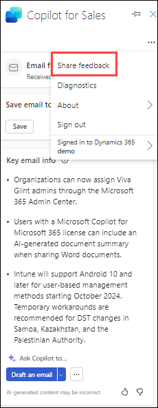

4.	Enter your responses in the feedback form and then select **Send**.

    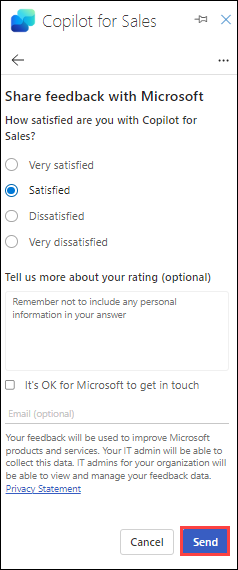

### Task 2.4: Video related to Copilot for Sales

1. Select **Options(...)** in the upper-right corner, and then select **About** > **Watch video**.

    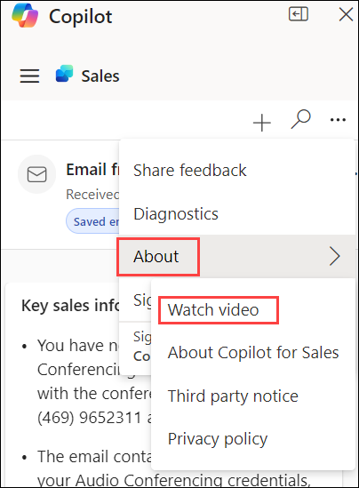

   Video about the Brief introduction about the **Copilot for Sales**

    
   

### Task 2.5: About Copilot for Sales

1. Select **Options(...)** in the upper-right corner, and then select **About** > **About Copilot for Sales**. Here it will explain about the Copilot for Sales.

    
   

    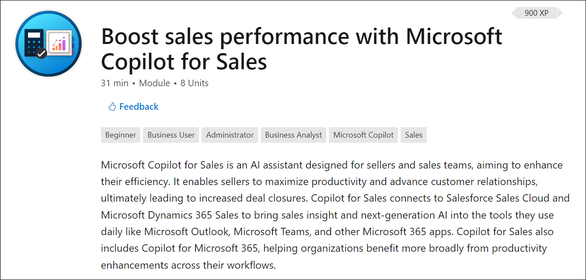    

### Task 2.6: Sign out of Copilot for Sales

When you sign in and reconnect to the same CRM system and environment, your information is restored to the state it was in before you signed out. If you connect to a different CRM system or a different environment, the information is not restored.

1.	Open **Copilot for Sales** in Outlook.

2.	Select **Options(...)** in the upper-right corner, and then select **Sign out**.

    

### Task 2.7: View Pricvacy policies for Copilot for Sales

1.	Open **Copilot for Sales**.

1.	Select **Options(...)** in the upper-right corner, and then select **About** > **Privacy policy**. To view Microsoft Privacy policies.

    

1.	Select **Delete Account**.

      

## Review

In this lab, you have explored various CRB actions and capablities in Teams and Outlook

### You have successfully completed the lab.
